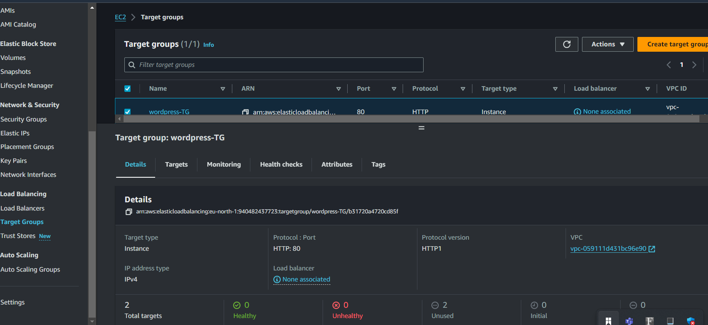
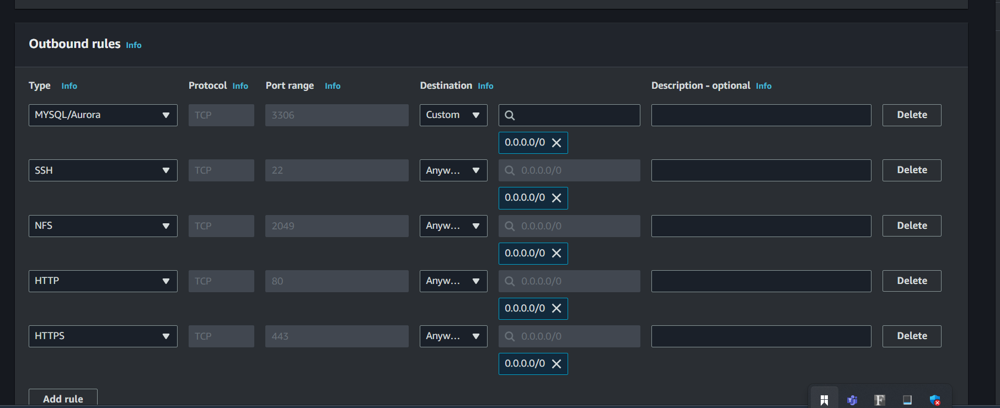

# VPC Design for WordPress with Amazon RDS (MySQL), Load Balancer, Auto Scaling, NAT Gateway, and EFS

## Project Overview
This project outlines the design and implementation of a high-availability and scalable WordPress architecture hosted on AWS. The architecture involves hosting WordPress on EC2 instances in private subnets across two Availability Zones, connected to an Amazon RDS (MySQL) database. The design leverages an Elastic File System (EFS) for shared storage among the instances, NAT Gateways for outbound internet access, and Load Balancer with Auto Scaling to ensure performance and fault tolerance.

### Key Components:
- **Amazon VPC (Virtual Private Cloud)**
- **Public and Private Subnets (App Subnets and Data Subnets)**
- **Internet Gateway**
- **NAT Gateways (for outbound traffic)**
- **Amazon EC2 Instances (for WordPress)**
- **Amazon RDS (MySQL)**
- **Elastic Load Balancer (ALB)**
- **Auto Scaling Groups (ASG)**
- **Amazon EFS (Elastic File System)**
- **Security Groups and NACLs**

---

## Architecture Design

### 1. **VPC Configuration**
   - **VPC Name**: `WordPress-VPC`
   - **CIDR Block**: `160.10.0.0/18`
   - The VPC was created to host the public and private subnets across two Availability Zones (AZs) to ensure high availability.

   

### 2. **Subnets**
   The design incorporates both public and private subnets distributed across two Availability Zones.

   - **Public Subnets** (For NAT Gateways):
     - Subnet 1 (AZ-1): `160.10.0.0/26`
     - Subnet 2 (AZ-2): `160.10.0.64/26`
   
   - **Private Subnets**:
     - **Private App Subnets** (For WordPress EC2 instances):
       - Subnet 1 (AZ-1): `160.10.0.128/26`
       - Subnet 2 (AZ-2): `160.10.0.192/26`
     - **Private Data Subnets** (For RDS MySQL Database):
       - Subnet 1 (AZ-1): `160.10.1.0/26`
       - Subnet 2 (AZ-2): `160.10.1.64/26`

---

## Components Setup

### 1. **Internet Gateway (IGW)**
   - **IGW Name**: `WordPress-IGW`
   - The Internet Gateway was created which will provide the necessary internet connectivity for resources in public subnets, such as the NAT Gateways.

   

### 2. **NAT Gateways**
   - **NAT Gateway 1**: Deployed in Public Subnet 1 (AZ-1) with an Elastic IP.
   - **NAT Gateway 2**: Deployed in Public Subnet 2 (AZ-2) with an Elastic IP.
   - The NAT Gateways will provide instances in the **private subnets** with outbound internet access, while preventing inbound internet traffic.

   

### 3. **Route Tables**
   - **Public Route Table**: Associated with the public subnets, routing internet-bound traffic (`0.0.0.0/0`) to the **Internet Gateway (IGW)**.
   - **Private Route Tables**:
     - For Private App Subnets, routes outbound traffic (`0.0.0.0/0`) to the **NAT Gateways** in respective AZs.
     - Private Data Subnets will not have outbound internet traffic.

---

## Storage Configuration

### 1. **Amazon EFS (Elastic File System)**
   - **EFS Name**: `WordPress-EFS`
   - The EFS will be used to provide shared storage between WordPress EC2 instances, ensuring consistent file access across all instances in both AZs, so we created EFS in both availability zones.
   - **Access Points**: Mounted to all WordPress EC2 instances in both AZs.
  

  ---

## RDS Creating

### 1. **Amazon RDS (MySQL)**
   The Amazon RDS (MYSQL) was created with two availability zone, to be publicly accessible, with names and passwords to be used to connect to wordpress.
    - **Multi-AZ Deployment**: Enabled to replicate data between two AZs for high availability.
   - **Security Group**:
     - Allow inbound MySQL traffic (port 3306) from the EC2 instances (WordPress).
    

---

## Database Configuration

### 1. **Amazon RDS (MySQL)**
   - **Instance Type**: `db.t3.micro` (scalable based on traffic).
   - **Engine**: MySQL
   - **Security Group**:
     - Allow inbound MySQL traffic (port 3306) from the EC2 instances (WordPress).

   - **AMI**: Amazon Linux 2 was created to host the Amazon Database, We were able to access the instance in the private subnet through Bastion Host, the following scripts where run to install and configure the server to host the database.
   
"
#! /bin/bash 

#1. create the html directory and mount the efs to it
sudo mkdir -p /var/www/html
sudo mount -t nfs4 -o nfsvers=4.1,rsize=1048576,wsize=1048576,hard,timeo=600,retrans=2,noresvport fs-03c9b3354880b36a6.efs.us-east-1.amazonaws.com:/ /var/www/html

#2. Install Mysqld
sudo rpm -Uvh https://dev.mysql.com/get/mysql57-community-release-el7-11.noarch.rpm
sudo rpm --import https://repo.mysql.com/RPM-GPG-KEY-mysql-2022
sudo yum install mysql-community-server -y
sudo systemctl enable mysqld
sudo systemctl start mysqld

#3. install php 7.4
sudo yum clean metadata
sudo yum install php php-common php-pear -y
sudo yum install php-{cgi,curl,mbstring,gd,mysqlnd,gettext,json,xml,fpm,intl,zip} -y
  
#4. set permissions
sudo usermod -a -G apache ec2-user
sudo chown -R ec2-user:apache /var/www
sudo chmod 2775 /var/www && find /var/www -type d -exec sudo chmod 2775 {} \;
sudo find /var/www -type f -exec sudo chmod 0664 {} \;
sudo chown apache:apache -R /var/www/html 

#5. set permissions
sudo usermod -a -G apache ec2-user
sudo chown -R ec2-user:apache /var/www
sudo chmod 2775 /var/www && find /var/www -type d -exec sudo chmod 2775 {} \;
sudo find /var/www -type f -exec sudo chmod 0664 {} \;
sudo chown apache:apache -R /var/www/html 

#6. download wordpress files
wget https://wordpress.org/latest.tar.gz
tar -xzf latest.tar.gz
cp -r wordpress/* /var/www/html/

#7. create the wp-config.php file
cp /var/www/html/wp-config-sample.php /var/www/html/wp-config.php
   "

After connecting to the Database engine, we ran the command "CREATE DATABASE" to create the wordpress database and used the database name to configure the wp-config.php.

we configure the wp-config.php file to adjust the information on the Database

"
define( 'DB_NAME', 'your_database_name' );

/** MySQL database username */
define( 'DB_USER', 'your_database_user' );

/** MySQL database password */
define( 'DB_PASSWORD', 'your_database_password' );

/** MySQL hostname (RDS endpoint) */
define( 'DB_HOST', 'your-rds-endpoint.amazonaws.com' );

/** Database Charset to use in creating database tables. */
define( 'DB_CHARSET', 'utf8' );

/** The Database Collate type. Don't change this if in doubt. */
define( 'DB_COLLATE', '' );
"

   ### 1. **Amazon EC2 Instances (WordPress)**
   - **Instance Type**: `t2.micro` (Or scalable based on traffic).
   ## WordPress Deployment
   - **Placement**:
     - EC2 instances hosting WordPress will be deployed in the **Private App Subnets** in both AZs (AZ-1 and AZ-2) for high availability.

   Apache and PHP preinstalled, started and running and configured with shell script and EFS mounted and Apache server restarted. The scripts below was used for the webserver server.

"
#1. install apache 
sudo yum update -y
sudo yum install -y httpd httpd-tools mod_ssl
sudo systemctl enable httpd 
sudo systemctl start httpd

#2. create the html directory and mount the efs to it
mkdir -p /var/www/html
sudo mount -t nfs4 -o nfsvers=4.1,rsize=1048576,wsize=1048576,hard,timeo=600,retrans=2,noresvport fs-03c9b3354880b36a6.efs.us-east-1.amazonaws.com:/ /var/www/html

#3. install php 7.4
sudo yum clean metadata
sudo yum install php php-common php-pear -y
sudo yum install php-{cgi,curl,mbstring,gd,mysqlnd,gettext,json,xml,fpm,intl,zip} -y

#4. set permissions
sudo usermod -a -G apache ec2-user
sudo chown -R ec2-user:apache /var/www
sudo chmod 2775 /var/www && find /var/www -type d -exec sudo chmod 2775 {} \;
sudo find /var/www -type f -exec sudo chmod 0664 {} \;
sudo chown apache:apache -R /var/www/html 

#5. restart the webserver
service httpd restart
   "
   

### 2. **Elastic Load Balancer (ALB)**
   - **Type**: Application Load Balancer (ALB) to manage HTTP and HTTPS traffic.
   - **Target Group**: EC2 instances running WordPress. Target group was set up to target the instances to be used by the load balancer. 
   
   

   - **Health Checks**: Set up to monitor the health of the instances in both Availability Zones.
   - **High Availability**: The Load Balancer will distribute traffic between the EC2 instances in both AZs for fault tolerance.

   

### 3. **Auto Scaling Group (ASG)**
   - **ASG Name**: `WordPress-ASG`
   - Configured to automatically scale the number of EC2 instances based on load.
   We created a launch template that had the script to pre install and run apache, mount efs and install php

   - **Scaling Policies**:
     - **Minimum instances**: 3 (1 per AZ)
     - **Maximum instances**: 5
     - **Desired instances**: 3

Auto scale was created with the already created load balancer.

     

---

## Security Configurations

### 1. **Security Groups**
   - **Web Server Security Group (EC2 Instances)**:
     - Allow inbound HTTP (80) and HTTPS (443) traffic from the Load Balancer.
     - Allow outbound traffic to the NAT Gateway for internet access.
     - Allow MySQL traffic to the RDS MySQL Database on port 3306.
     - Allow access to EFS for shared storage.
   
   - **Database Security Group (RDS)**:
     - Allow inbound MySQL traffic (3306) from WordPress EC2 instances only.
   
   - **NAT Gateway Security Group**:
     - Allow outbound internet traffic for instances in the private subnet.

### 2. **NACLs (Network Access Control Lists)**
   - **Public Subnets NACL**:
     - Inbound: Allow HTTP, HTTPS, and SSH traffic from external sources.
     - Outbound: Allow traffic to the Internet Gateway.
   
   - **Private Subnets NACL**:
     - Allow inbound traffic on port 3306 for MySQL from the EC2 instances.
     - Outbound traffic allowed to the NAT Gateways for internet access.

---

## Challenges

### 1. **EFS Mounting**
We experienced a real deal of a challenge trying to mount the EFS on the subnet because we had a different route table as main route table of the vpc which isn't associated to an internet gateway, we finally enabled DNS hostname and changed the private route table to the main route table and then we were able to connect.

### 2. **Accessing instance in the private subnet**
I knew we cannot just access the instances in private subnet but had to and we were not able to connect to private subnet, so we use a Bastion Host to connect into the private subnet from the public subnet instance. But then we could not even connect to the public subnet until we allowed all traffic in the NACLs Outbound rule. Afterwards i tried to access the private subnet instance from the public subnet and i was not able to access it, until i allowed certain ephemeral ports (e.g., 32768 - 65535) to return traffic in NACLs because as we know, they are stateless, and then i was able to access.

### 3. **RDS Access**
After creating RDS, accessing was a challenge from the workbench to create a Database till i realized it was impossible accessing the engine from my workbench being that the rds was created in a private subnet, so i accessed the engine from the private subnet instance and created the database through the command.

## Conclusion
This VPC design ensures a highly available and scalable WordPress deployment with a robust MySQL backend hosted on Amazon RDS. Using Auto Scaling, Elastic Load Balancer, and NAT Gateways ensures that the system can handle fluctuating traffic loads and provide reliable service. The integration of Amazon EFS allows WordPress instances across multiple Availability Zones to share storage seamlessly, enhancing data consistency.
